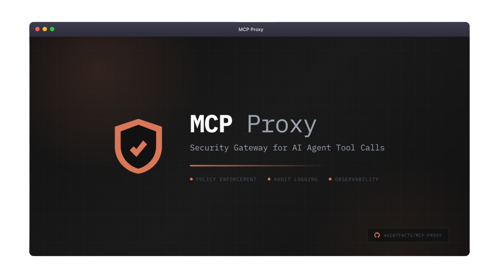
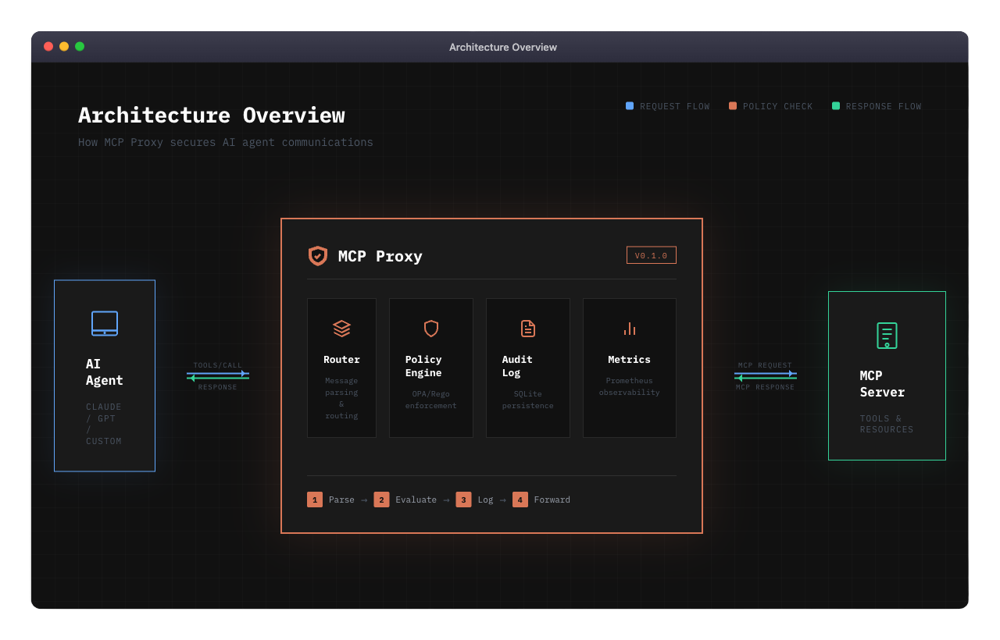

<p align="center">
  
</p>

<div align="center">

# MCP Proxy

**A high-performance security gateway for the Model Context Protocol**

[](https://go.dev/)
[](LICENSE)
[](https://github.com/agentfacts/mcp-proxy/actions)
[](https://goreportcard.com/report/github.com/agentfacts/mcp-proxy)

[Getting Started](#-quick-start) •
[Documentation](#-documentation) •
[Contributing](#-contributing) •
[Roadmap](#-roadmap)

</div>

---

## Why MCP Proxy?

As AI agents gain access to more powerful tools, **security becomes critical**. MCP Proxy sits between your AI agents and MCP servers, providing:

<table>
<tr>
<td width="50%">

### 🛡️ Policy Enforcement
Fine-grained access control using OPA policies. Define exactly what tools each agent can access and under what conditions.

</td>
<td width="50%">

### 📋 Audit Logging
Complete audit trail of every tool call. Know exactly what your agents are doing, when, and why.

</td>
</tr>
<tr>
<td width="50%">

### ⚡ High Performance
Sub-microsecond routing latency. Your agents won't even notice it's there.

</td>
<td width="50%">

### 📊 Observability
Prometheus metrics and health endpoints. Full visibility into your AI infrastructure.

</td>
</tr>
</table>

---

## ✨ Features

<p align="center">
  
</p>

| Feature | Description |
|---------|-------------|
| **OPA Policy Engine** | Write policies in Rego for fine-grained access control |
| **SQLite Audit Store** | Persistent, queryable audit logs with configurable retention |
| **SSE Transport** | Server-Sent Events for real-time bidirectional communication |
| **Session Management** | Secure session handling with TTL and connection limits |
| **Prometheus Metrics** | Request latency, policy decisions, error rates |
| **Health Checks** | Kubernetes-ready liveness and readiness probes |
| **TLS Support** | Encrypted communications for production deployments |

---

## 🚀 Quick Start

### Option 1: Go Install

```bash
go install github.com/agentfacts/mcp-proxy/cmd/proxy@latest
```

### Option 2: Build from Source

```bash
git clone https://github.com/agentfacts/mcp-proxy.git
cd mcp-proxy
make build
./bin/mcp-proxy --config config/proxy.yaml
```

### Option 3: Docker

```bash
docker run -p 3000:3000 ghcr.io/agentfacts/mcp-proxy:latest
```

<details>
<summary><b>Docker Compose (Development Stack)</b></summary>

```bash
# Start PostgreSQL, Redis, and supporting services
make docker-up

# Or with the full stack including the proxy
docker-compose --profile full up -d
```

</details>

---

## ⚙️ Configuration

Create a `config.yaml` file:

```yaml
version: "1.0"

server:
  listen:
    address: "0.0.0.0"
    port: 3000
  transport: "sse"

upstream:
  url: "http://your-mcp-server:8080"
  transport: "sse"

policy:
  enabled: true
  mode: "enforce"      # "audit" to log only, "enforce" to block
  policy_dir: "policies"

audit:
  enabled: true
  db_path: "audit.db"
```

<details>
<summary><b>Environment Variables</b></summary>

All configuration can be overridden via environment variables:

| Variable | Description | Default |
|----------|-------------|---------|
| `MCP_SERVER_PORT` | Proxy listen port | `3000` |
| `MCP_UPSTREAM_URL` | Upstream MCP server URL | - |
| `MCP_POLICY_MODE` | Policy mode (audit/enforce) | `enforce` |
| `MCP_POLICY_ENABLED` | Enable policy engine | `true` |
| `MCP_AUDIT_ENABLED` | Enable audit logging | `true` |
| `MCP_LOGGING_LEVEL` | Log level (debug/info/warn/error) | `info` |
| `MCP_METRICS_ENABLED` | Enable Prometheus metrics | `false` |
| `MCP_HEALTH_ENABLED` | Enable health endpoints | `false` |

</details>

<details>
<summary><b>Full Configuration Reference</b></summary>

See [config/proxy.yaml](config/proxy.yaml) for a complete configuration example with all available options.

</details>

---

## 📜 Writing Policies

Policies are written in [Rego](https://www.openpolicyagent.org/docs/latest/policy-language/), OPA's declarative policy language.

### Example: Restrict File System Access

```rego
package mcp.policy

default allow = false

# Allow read operations for agents with read capability
allow {
    input.method == "tools/call"
    startswith(input.tool, "read_")
    has_capability("read:*")
}

# Block write operations to sensitive directories
deny {
    input.method == "tools/call"
    input.tool == "write_file"
    startswith(input.arguments.path, "/etc/")
}

# Helper: check if agent has capability
has_capability(cap) {
    input.agent.capabilities[_] == cap
}
```

### Example: Rate Limiting

```rego
package mcp.policy

# Limit to 100 requests per session
deny {
    input.session.request_count > 100
}
```

See [policies/](policies/) for more examples.

---

## 📈 Performance

MCP Proxy is designed for minimal overhead:

| Operation | Latency | Allocations |
|-----------|---------|-------------|
| Route Message | **~1 µs** | 26 allocs |
| Parse Request | **~337 ns** | 5 allocs |
| Generate Request ID | **~87 ns** | 1 alloc |

<details>
<summary><b>Run Benchmarks</b></summary>

```bash
go test -bench=. -benchmem ./internal/router/...
```

</details>

---

## 📊 Observability

### Metrics (Prometheus)

Enable with `metrics.enabled: true`:

```bash
curl http://localhost:9090/metrics
```

Available metrics:
- `mcp_proxy_requests_total` - Total requests by method and status
- `mcp_proxy_request_duration_seconds` - Request latency histogram
- `mcp_proxy_policy_decisions_total` - Policy decisions by result
- `mcp_proxy_active_sessions` - Current active sessions

### Health Checks

Enable with `health.enabled: true`:

```bash
# Liveness probe
curl http://localhost:8080/health

# Readiness probe
curl http://localhost:8080/ready
```

---

## 🗂️ Project Structure

```
mcp-proxy/
├── cmd/proxy/           # Application entry point
├── config/              # Configuration files
├── docs/                # Documentation
├── internal/
│   ├── audit/           # SQLite audit store
│   ├── config/          # Configuration loading
│   ├── observability/   # Metrics & health checks
│   ├── policy/          # OPA policy engine
│   ├── router/          # Message routing
│   ├── session/         # Session management
│   ├── transport/sse/   # SSE transport
│   └── upstream/        # Upstream client
├── policies/            # Example Rego policies
└── scripts/             # Utility scripts
```

---

## 📚 Documentation

| Document | Description |
|----------|-------------|
| [Setup Guide](docs/setup-guide.md) | Detailed installation and configuration |
| [Contributing](CONTRIBUTING.md) | How to contribute |
| [Changelog](CHANGELOG.md) | Version history |
| [Security](SECURITY.md) | Security policy |

---

## 🗺️ Roadmap

- [x] SSE transport support
- [x] OPA policy engine
- [x] SQLite audit logging
- [x] Prometheus metrics
- [ ] STDIO transport
- [ ] HTTP transport
- [ ] WebSocket transport
- [ ] AgentFacts verification
- [ ] Policy hot-reload
- [ ] Admin API
- [ ] Web dashboard

---

## 🤝 Contributing

We welcome contributions! Please see our [Contributing Guidelines](CONTRIBUTING.md).

```bash
# Clone the repo
git clone https://github.com/agentfacts/mcp-proxy.git
cd mcp-proxy

# Install dependencies
go mod download

# Run tests
make test

# Run linter
make lint
```

---

## 📄 License

MIT License - see [LICENSE](LICENSE) for details.

---

<div align="center">

**[⬆ Back to Top](#mcp-proxy)**

Made with ❤️ by [AgentFacts](https://github.com/agentfacts)

</div>
